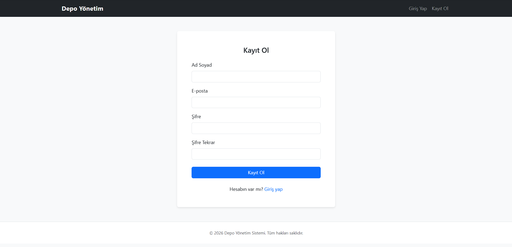
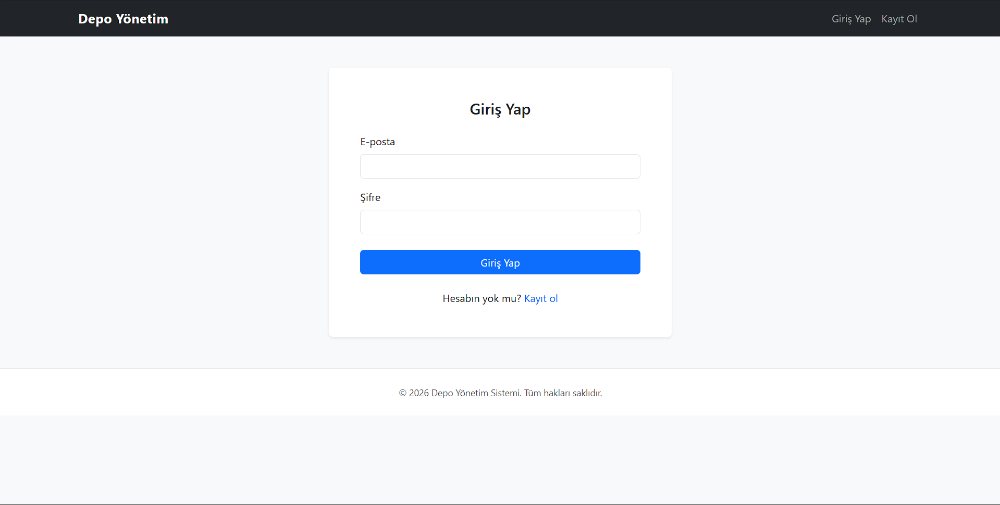
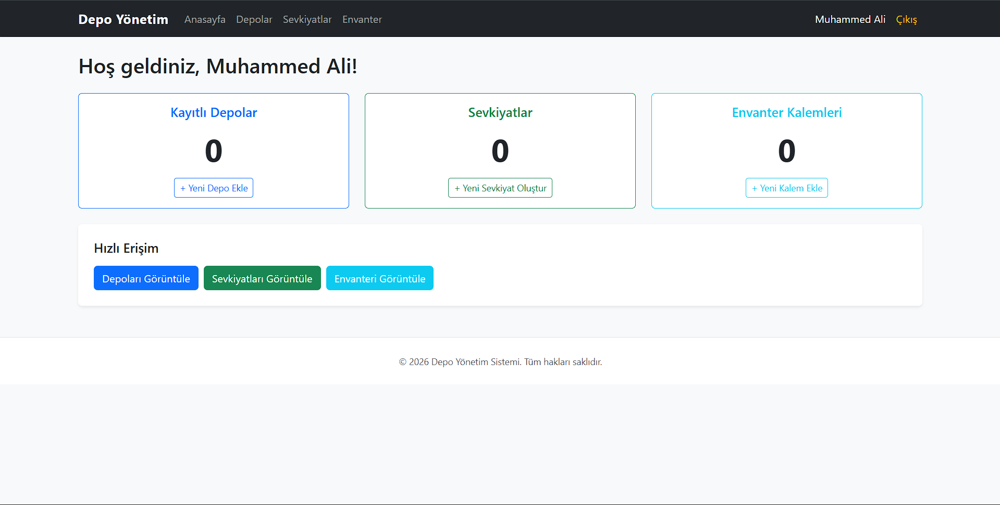
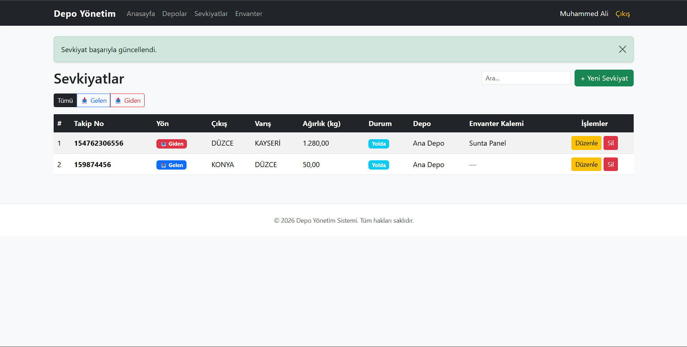
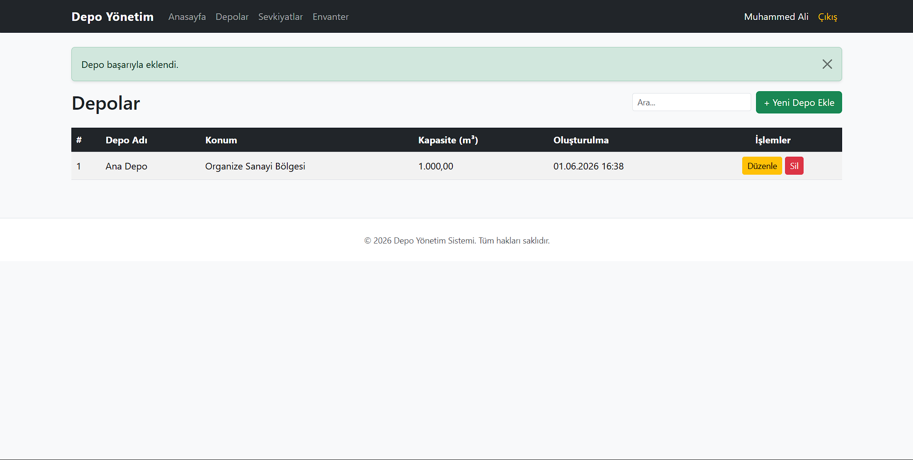
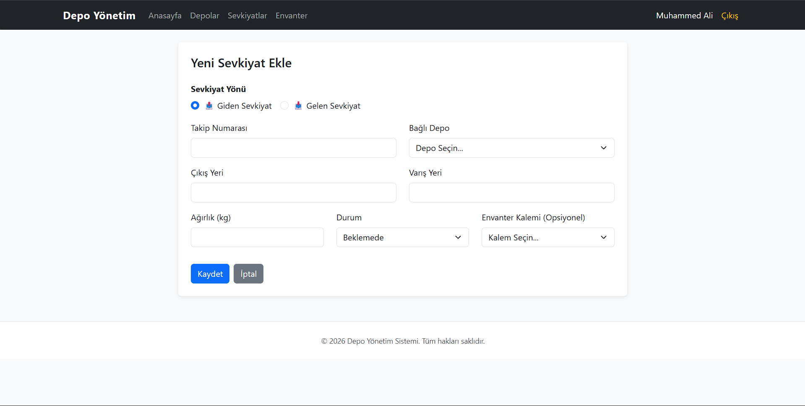
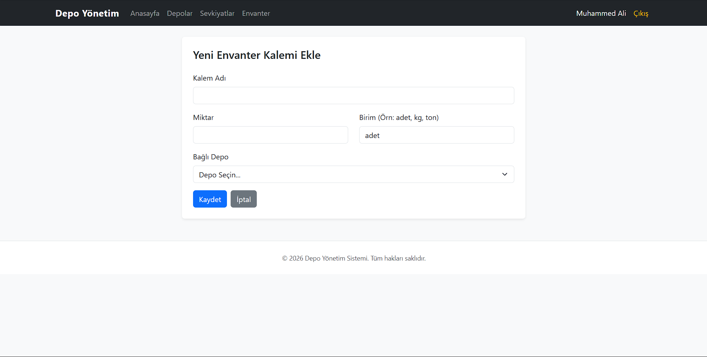

# 📦 Lojistik Depo Yönetim Sistemi

Bu proje, bir lojistik veya depo firmasının kendi depolarını, envanter kalemlerini ve sevkiyat süreçlerini (gelen/giden) yönetmesini sağlayan kapsamlı bir web uygulamasıdır. PHP (Nesne Yönelimli Programlama - OOP) ve MySQL (PDO) kullanılarak **özel bir MVC benzeri mimari** ile geliştirilmiştir. Bootstrap 5 sayesinde modern, responsive (mobil uyumlu) ve kullanıcı dostu bir arayüze sahiptir.

🌍 **Canlı Demo:** http://95.130.171.20/~st24360859078/
*(Not: Hosting ortamında test edilmek üzere yüklenmiştir.)*

🎥 **Tanıtım Videosu:** [https://www.youtube.com/watch?v=1BSUEsKapMY](#)

---

## 🚀 Özellikler

- **Kullanıcı Yönetimi (Auth Sistemi)**
  - Güvenli kayıt olma ve giriş yapma süreçleri (`password_hash` ile şifrelenmiş).
  - Kullanıcıya özel (Session tabanlı) oturum yönetimi.
  
- **Depo Yönetimi**
  - Yeni depolar tanımlama, kapasite (m³) ve konum bilgisi ekleme.
  - Birden fazla depoyu sistem üzerinden tek ekrandan kontrol edebilme.

- **Envanter & Stok Yönetimi**
  - Depolara ait yeni envanter kalemleri ekleme.
  - Anlık stok durumunu izleyebilme.
  
- **Sevkiyat & Lojistik Modülü**
  - **Gelen ve Giden** olmak üzere iki yönlü sevkiyat oluşturabilme.
  - "Beklemede, Yolda, Teslim Edildi" gibi durum güncellemeleri yapabilme.
  - **Stok Entegrasyonu:** Sevkiyat durumu "teslim edildi" olduğunda giden sevkiyatlar stoku otomatik düşürür, gelen sevkiyatlar stoku otomatik artırır.
  - Stok yetersizliği durumlarında otomatik uyarı sistemi.

- **Gelişmiş Arama**
  - Depolar, Envanter ve Sevkiyatlar menülerinde sayfa yenilenmeden çalışan **anlık (JavaScript)** arama/filtreleme çubukları.

- **Güvenlik & Altyapı**
  - SQL Injection'a karşı **PDO Prepared Statements** kullanımı.
  - Nesne yönelimli mimari (OOP) sayesinde sürdürülebilir, modüler kod yapısı.
  - Dinamik yönlendirme sistemi (`$baseUrl` hesaplaması ile).

---

## 📸 Ekran Görüntüleri

| Kayıt Olma | Giriş Yapma |
|:---:|:---:|
|  |  |

| Dashboard (Kontrol Paneli) | Sevkiyatlar Menüsü |
|:---:|:---:|
|  |  |

| Depo Ekleme | Sevkiyat Ekleme | Envanter Kalemi Ekleme |
|:---:|:---:|:---:|
|  |  |  |

---

## 🛠️ Kurulum (Yerel Ortam)

Bu projeyi kendi bilgisayarınızda (XAMPP, MAMP vb. kullanarak) çalıştırmak için aşağıdaki adımları izleyebilirsiniz.

### 1. Veritabanı Oluşturma
1. Tarayıcınızdan `http://localhost/phpmyadmin` adresine gidin.
2. Yeni bir veritabanı oluşturun (Örneğin adını `depo_yonetim` yapın).
3. Üst menüden **İçe Aktar (Import)** sekmesine tıklayın ve proje dizininde yer alan `database.sql` dosyasını seçip yükleyin.
   *(Bu dosya tabloları ve tüm ilişkileri otomatik kuracaktır).*

### 2. Yapılandırma
1. Proje dizinindeki `config/config.example.php` dosyasının adını `config.php` olarak değiştirin (veya kopyasını oluşturun).
2. `config.php` dosyasını açıp kendi yerel veritabanı bilgilerinizi girin:
   ```php
   define('DB_HOST', 'localhost');
   define('DB_NAME', 'depo_yonetim');
   define('DB_USER', 'root');
   define('DB_PASS', '');
   ```

### 3. Çalıştırma
Projeyi XAMPP'in `htdocs` klasörü altına koyduysanız, tarayıcınızda şu adrese giderek sistemi kullanmaya başlayabilirsiniz:
`http://localhost/Depo_Yonetim/`

---

## 💻 Teknolojiler
- **Backend:** PHP 8.x (Nesne Yönelimli - OOP), PDO
- **Frontend:** HTML5, CSS3, JavaScript (Vanilla JS)
- **Tasarım Çerçevesi:** Bootstrap 5.3.3
- **Veritabanı:** MySQL (MariaDB)
